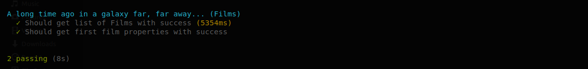
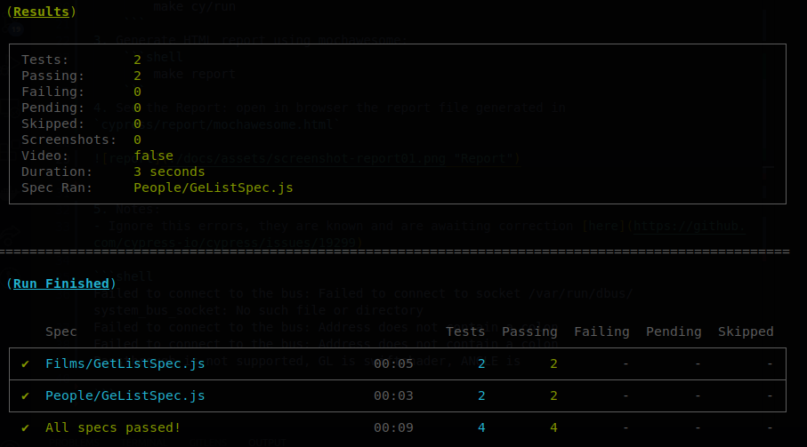
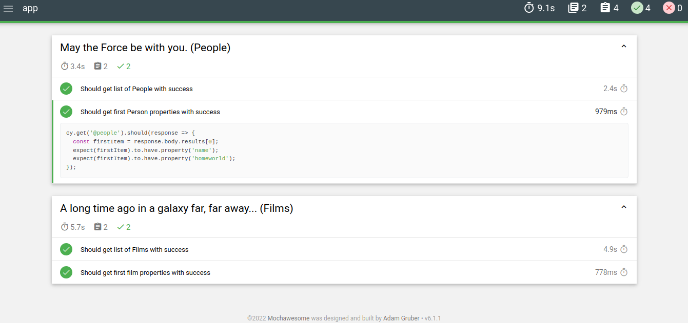

# Cypress with Docker

*"May the TEST be with you."*



Run cypress inside container using in headless mode and generate Html report.

Based in this project [Cypress Docker images](https://github.com/cypress-io/cypress-docker-images).

Used [Star Wars API](https://swapi.dev/) as a simple example to test.


## Stack

- Javascript
- [Cypress](https://www.cypress.io/)
- Docker

## How to use

Steps to use:
1. Build Local, start container and install dependencies: 
```shell
    make dev/local
```
2. Stop, Restart, Run commands inside container:
```shell
    # stop
    docker-compose down
    # restart
    docker-compose up -d
    # run commands inside container
    docker exec -it cypress-app [your command]
```
3. Run cypress headless:
```shell
    make cy/run
```


4. Generate HTML report using mochawesome:
```shell
    make report
```
5. See the Report: open in browser the report file generated path `cypress/report/mochawesome.html`




6. Notes:
- Tested in Linux Host Machine, on Mac M1 there as a errors reported, awaiting for fix.
- Ignore this errors, they are known and are awaiting correction [here](https://github.com/cypress-io/cypress/issues/19299)

```shell
Failed to connect to the bus: Failed to connect to socket /var/run/dbus/system_bus_socket: No such file or directory
Failed to connect to the bus: Address does not contain a colon
Failed to connect to the bus: Address does not contain a colon
Passthrough is not supported, GL is swiftshader, ANGLE is 

```
